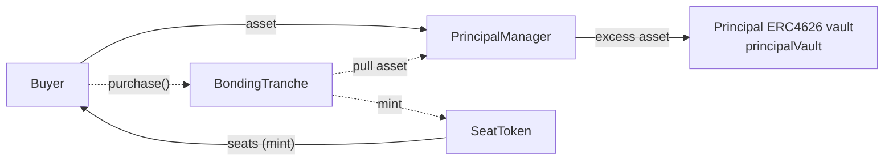
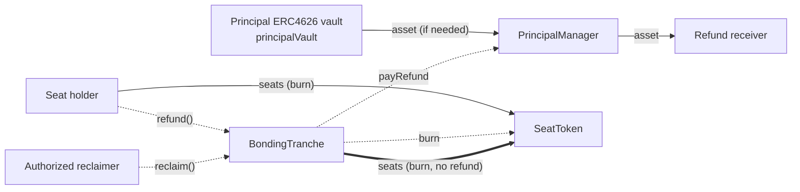
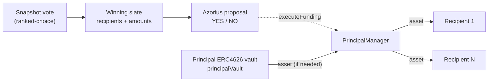

## PEN fund flows (end-to-end)

This document captures **how seats and assets move through PEN**, including the off-chain (Snapshot) and on-chain (Azorius) governance steps used for funding distributions.

Legend: solid arrows are token transfers (the underlying ERC20 `asset` or `SeatToken` seats), dashed arrows are non-transfer triggers/calls.

---

## Purchase (asset in, seats out)

---

## Refund and reclaim (seats burned, asset out on refund)

---

## Funding distribution (Snapshot → Azorius → payout)

Ranked-choice slate selection happens **off-chain** on Snapshot. On-chain governance is a simple **YES/NO** Azorius vote that, on execution, calls `PrincipalManager.executeFunding(recipients, amounts)`.

