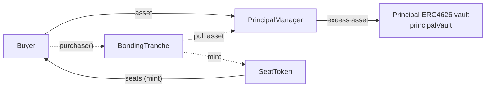
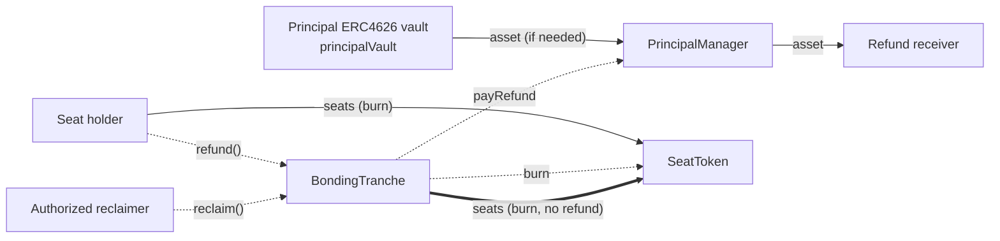
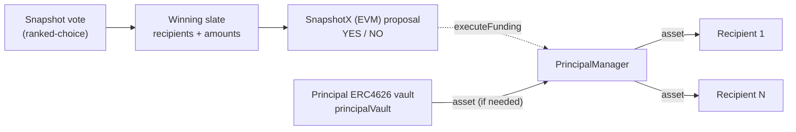
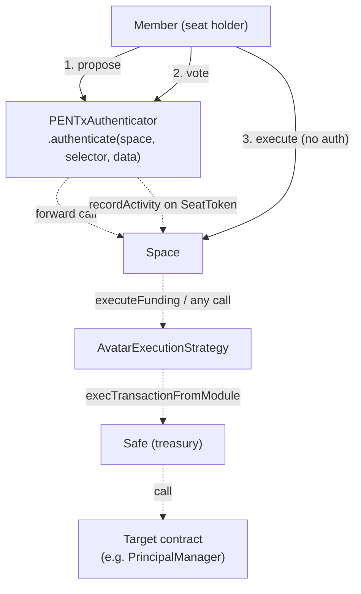

## PEN fund flows (end-to-end)

This document captures **how seats and assets move through PEN**, including the off-chain (Snapshot) and on-chain (Snapshot X / EVM) governance steps used for funding distributions.

Legend: solid arrows are token transfers (the underlying ERC20 `asset` or `SeatToken` seats), dashed arrows are non-transfer triggers/calls.

---

## Purchase (asset in, seats out)



---

## Refund and reclaim (seats burned, asset out on refund)



---

## Funding distribution (Snapshot → Snapshot X → payout)

Ranked-choice slate selection happens **off-chain** on Snapshot. On-chain governance is a simple **YES/NO** SnapshotX vote that, on execution, calls `PrincipalManager.executeFunding(recipients, amounts)`.



---

## Governance call chain (on-chain election cycle)

All governance interactions (propose, vote, update proposal) are routed through `PENTxAuthenticator.authenticate`. Members never call `Space` directly. `Space.execute` (finalization) is the only action that bypasses the authenticator and can be called by anyone.



---

## Step-by-step: seat setup (before any governance action)

### 1 — Buy a seat

Call `BondingTranche.purchase` directly (no authenticator involved).

```solidity
// Quote the cost first
uint256 cost = BondingTranche.quotePurchase(quantity);          // cost in asset units

// Approve the payment asset
IERC20(asset).approve(address(BondingTranche), cost);

// Purchase
BondingTranche.purchase(
    recipient,   // address — who receives the seat(s)
    quantity,    // uint256 — number of seats to buy
    maxCost      // uint256 — slippage guard; set to cost * 1.01 for 1% buffer
);
```

### 2 — Self-delegate voting power

`SeatToken` uses ERC20Votes checkpoints. A voting-power checkpoint does not exist until the holder delegates (the mint auto-delegates on first receipt, but an explicit call ensures the checkpoint is written before any proposal snapshot is taken).

```solidity
SeatToken.delegate(msg.sender);   // self-delegation only; delegating to others reverts
```

Wait at least 1 block after this call before creating a proposal.

---

## Step-by-step: governance actions (via PENTxAuthenticator)

All calls below follow the same pattern:

```solidity
PENTxAuthenticator.authenticate(
    address space,           // the Space contract address
    bytes4  functionSelector,
    bytes   calldata data    // ABI-encoded arguments for the Space function
);
```

`msg.sender` must equal the first address decoded from `data` (the author/voter), otherwise the call reverts with `InvalidMessageSender`.

---

### 3 — Create a proposal

**Selector:**
```solidity
bytes4 PROPOSE_SELECTOR = bytes4(keccak256("propose(address,string,(address,bytes),bytes)"));
```

**Execution payload** (the Safe transaction the proposal will execute if it passes):

```solidity
// For a funding proposal:
bytes memory executionPayload = abi.encode(
    new MetaTransaction[](1) // array of Safe transactions
    // MetaTransaction {
    //   to:        address(PrincipalManager),
    //   value:     0,
    //   data:      abi.encodeCall(PrincipalManager.executeFunding, (recipients, amounts)),
    //   operation: Enum.Operation.Call,
    //   salt:      0        // increment if you need to re-use identical params
    // }
);
```

> **Critical:** the execution payload hash is stored by the Space at proposal time and verified again at execution. You must use the **exact same payload bytes** when calling `Space.execute` later.

**Calldata (`data`):**

```solidity
bytes memory data = abi.encode(
    proposer,       // address — must equal msg.sender
    metadataURI,    // string  — IPFS URI or empty string
    Strategy({
        addr:   execStrategy,      // AvatarExecutionStrategy address
        params: executionPayload   // bytes from above
    }),
    abi.encode(userStrategies)     // see "voting strategies" note below
);

PENTxAuthenticator.authenticate(space, PROPOSE_SELECTOR, data);
```

After the transaction is mined, note the `proposalId` (read from `Space.nextProposalId()` before the call, or from emitted events).

Voting opens after `VOTING_DELAY` blocks from the proposal block.

---

### 4 — Cast a vote

**Selector:**
```solidity
bytes4 VOTE_SELECTOR = bytes4(keccak256("vote(address,uint256,uint8,(uint8,bytes)[],string)"));
```

**Choice encoding:** `0` = Against, `1` = For, `2` = Abstain

**Calldata (`data`):**

```solidity
IndexedStrategy[] memory userStrategies = new IndexedStrategy[](1);
userStrategies[0] = IndexedStrategy({ index: 0, params: "" });
// index 0 = stock OZVotesVotingStrategy, registered at Space initialisation
// params = empty; the strategy reads SeatToken address from its own registered params

bytes memory data = abi.encode(
    voter,            // address — must equal msg.sender
    proposalId,       // uint256
    uint8(1),         // Choice: 1 = For
    userStrategies,   // IndexedStrategy[]
    ""                // string metadata — leave empty
);

PENTxAuthenticator.authenticate(space, VOTE_SELECTOR, data);
```

Voting power is measured at `startBlockNumber` (the block the proposal was created + `VOTING_DELAY`). Seats bought after that block have no power on this proposal.

Calling `authenticate` also records seat activity — the voter's `lastActivityAt` is refreshed, counting toward the inactivity clock.

---

### 5 — Execute the proposal (no authenticator)

After `MIN_VOTING_DURATION` blocks have passed from `startBlockNumber` and the vote result is `For > Against` with quorum met, **anyone** can execute:

```solidity
Space.execute(
    proposalId,        // uint256
    executionPayload   // bytes — must be byte-for-byte identical to what was used in step 3
);
```

The Space verifies the payload hash, then calls `AvatarExecutionStrategy.execute`, which calls `Safe.execTransactionFromModule`, which calls the target (e.g. `PrincipalManager.executeFunding`).

---

## Quorum and majority rules


| Rule             | Value                                                                                     |
| ---------------- | ----------------------------------------------------------------------------------------- |
| Quorum           | `AVATAR_QUORUM = N` — at least N "For" vote required                                      |
| Majority         | `votesFor > votesAgainst` (simple majority)                                               |
| Abstain          | counts toward quorum, not toward majority                                                 |
| Execution window | opens at `startBlock + MIN_VOTING_DURATION`, closes at `startBlock + MAX_VOTING_DURATION` |
